<h1 align="center" style="border-bottom: none">
<br>
Block URL
<br>
</h1>

A Chrome extension that blocks URLs of your choice. Supports various URL patterns.

Those who want to simply block URLs at a browser level (i.e., personal reason, work distraction, etc) will appreciate this extension to help with their daily browsing.

## Contents

1. [Intro](#block-url-extension)
2. [Chrome Manifest Version](#chrome-manifest-version)
3. [Tech Stack](#tech-stack)
4. [Development](#development)
5. [Extension Installation](#extension-installation)
6. [Extension Usage](#extension-usage)
7. [Supported URL Patterns](#supported-url-patterns)
8. [Ignoring URLs (Comments)](#ignoring-urls-comments)
9. [FAQ](#faq)
10. [Issues](#issues)
11. [Contribute](#contribute)
12. [License](#license)

## Chrome Manifest Version

This extension uses Manifest V3.

## Tech Stack

### Extension

- React
- TypeScript
- Material UI
- Tailwind CSS
- Monaco Editor
- Vite

### Docs

- VitePress

## Development

Follow the steps below to build the extension manually.

1. Install Node.js.
2. Clone the repository.
3. Install dependencies.

```bash
npm install
```

4. Build the extension.

```bash
npm run build
```

5. The extension contents are located in the `dist` folder.

6. Go to [Extension Installation](#extension-installation) to install the extension locally.

## Extension Installation

\*\*Before installation and usage, please read the [FAQ](#faq) as it contains important questions and answers which are good to know as a user of this extension.

### Chrome Web Store

TBA

### Manual

1. Build the extension via the steps in the [development](#development) section.

2. Go to "Mange Extensions" on Chrome.

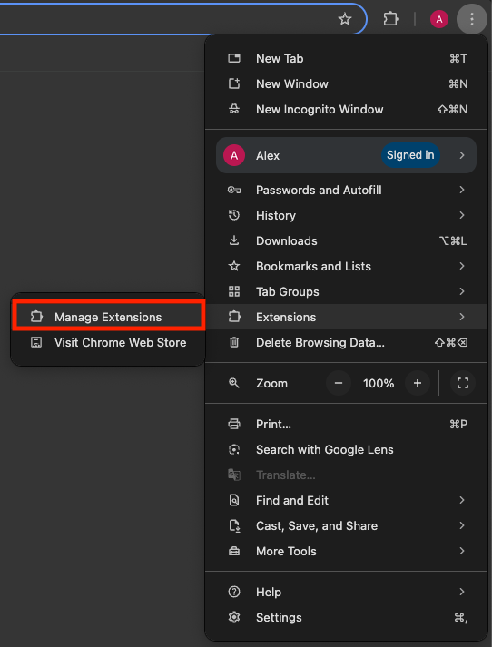

3. Enable "Developer mode".

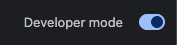

4. Click on "Load unpacked" and locate the `dist` folder.

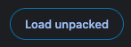

## Extension Usage

### Default Usage

1. Open the extension.

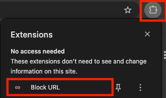

2. Open the extension settings.

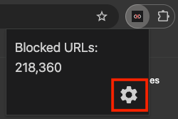

3. Enter your URLs in the editor. Once you entered them, press the save icon on the top left. Alternatively, you can press Cmd+S (macOS) or Ctrl+S (Windows/Linux) as the save shortcut.

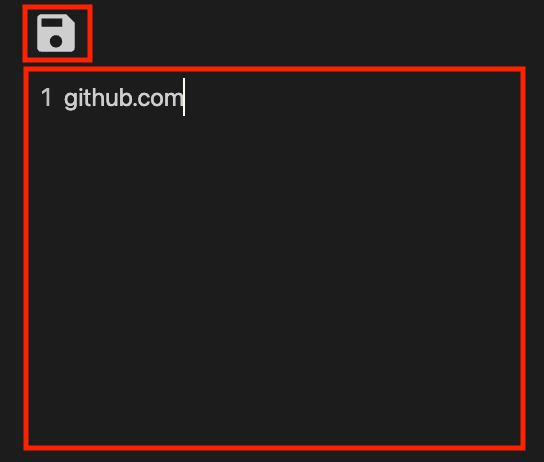

4. A dialog will popup telling you to save. Press the save confirmation button to save the URLs. If you have lots of URLs, this may take a few seconds before it completes the operation.

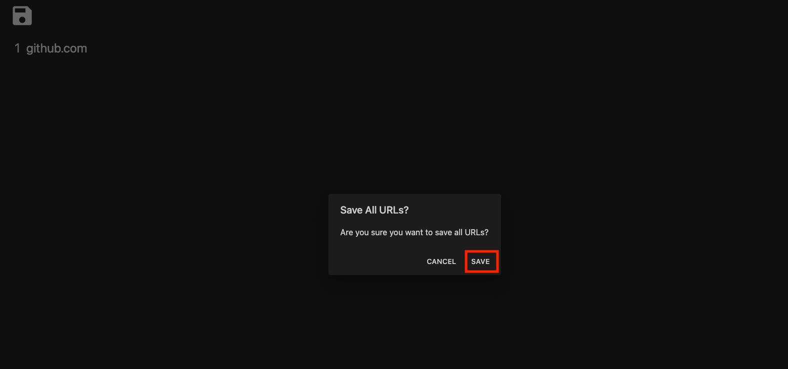

5. If you go to the URL that you intended to block, it will redirect you to the error page instead of the URL.

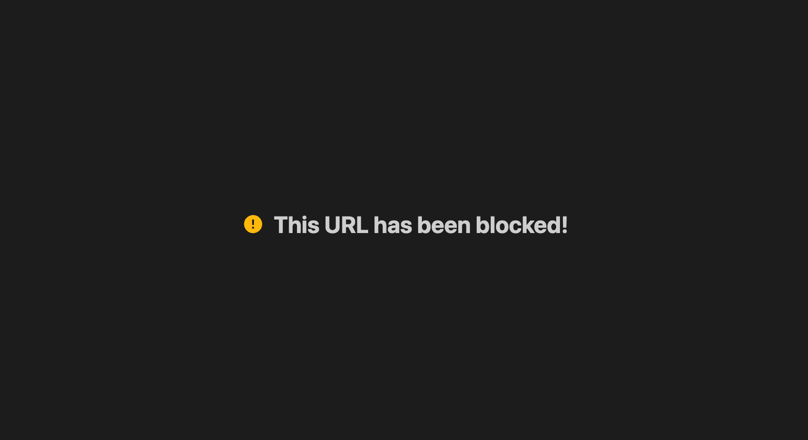

### Using the Extension in Incognito

1. Go to "Manage Extensions".


2. Under the Block URL extension, press "Details".

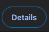

3. Turn on "Allow in Incognito".

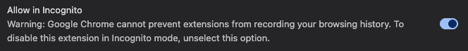

## Supported URL Patterns

Below are the supported URL patterns (not 100% battle tested):

1. [Steven Black hosts](https://github.com/StevenBlack/hosts).
   - `0.0.0.0<whitespace character><url>`
2. Exact URLs
   - `http[s]://<subdomain><url>.<tld>`
3. Wildcard URLs, including known paths.
   - `<url>/*`
   - `<url>/<known path>/*`
4. URLs without protocol.
   - `<subdomain>.<url>.<tld>`
5. URLs without subdomain.
   - `http[s]://<url>.<tld>`
6. Partial keyword URLs.
   - `<url>/[<keyword>, <...>]`

### Examples

#### Steven Black Hosts

```plaintext
0.0.0.0 facebook.com
```

#### Exact URLs

```plaintext
https://react.dev/reference/react
```

#### Wildcard URLs

For example, this would block any URL under youtube.com.

```plaintext
youtube.com/*
```

In the editor, the `/*` part of the URL should be highlighted:

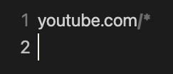

#### URLs Without Protocol

```plaintext
www.linkedin.com
```

#### URLs without subdomain

```plaintext
https://github.com
```

#### Partial Keyword URLs

1. For example, this will block any URL under google.com that contains "linkedin"

```plaintext
google.com/[linkedin]
```

In the editor, the `/[<keyword>]` part of the URL will be highlighted.

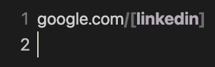

2. This example will block any path under google.com that contains either "linkedin" or "stackoverflow" _but not both_.

```plaintext
google.com/[linkedin, stackoverflow]
```

In the editor, the `/[<keyword>, <keyword>]` part of the URL will be highlighted. Each keyword will be highlighted.

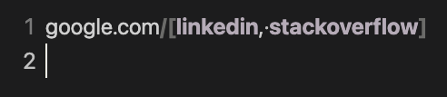

## Missing a Pattern?

If there is a pattern that is not supported but you want it, please post a new [issue](https://github.com/alexwkleung/block-url-extension/issues) for it to be considered in a future update. Be descriptive and provide thorough examples.

## Ignoring URLs (Comments)

You can ignore URLs using the comment syntax. Add one of these characters at the beginning of the line to create a comment:

- `#`
- `//`

## FAQ

1. **Where does my data get stored?**

   - This extension stores the URL data locally on your device.

2. **Why is the `unlimitedStorage` permission enabled?**

   - The `unlimitedStorage` permission is enabled so that there won't be any storage limitations for the extension. Your local device's hard drive is much larger than the allotted 10MB for a Chrome extension and the stored data may exceed that limit if you have a lot of URLs.

3. **Do I need to backup my URLs?**

   - Yes, absolutely. You have to backup your URLs somewhere.
   - For example, if you reinstall the extension, all your URLs will be erased and you have to save them again in the settings.

4. **Are you able to see the URLs in my browser history and visited sites?**

   - No, your browser history and visited sites are only seen by you.
   - The extension will read the data of your tabs (URL, loading state, etc) only. Your browser history or visited sites are unknown to the extension - especially when it comes to the computational logic.

5. **How can I confirm that you're not doing anything suspicious when I visit a URL?**

   - The service worker and content script are responsible for handling the logic that deals with tabs and when a URL is visited. You can view the respective code here:
     - [service_worker.ts](https://github.com/alexwkleung/block-url-extension/blob/main/src/service-worker/service_worker.ts)
     - [content.ts](https://github.com/alexwkleung/block-url-extension/blob/main/src/content/content.ts)
   - Basic overview:

     - `service_worker.ts` runs in the background when the extension is running. It handles displaying the error page and reading your tab data to execute existence logic between the tab URL and storage.
     - `content.ts` handles the document logic on the client, specifically an observer to detect the document state. It communicates with the service worker using messages to execute code.

   - In addition, [url-exists-in-chrome-storage.ts](https://github.com/alexwkleung/block-url-extension/blob/main/src/utils/url-exists-in-chrome-storage.ts) is the utility function used in `service_worker.ts` to determine if the error page should be sent to the client or not.

6. **Why are there are two ways to insert a comment?**

   - Some pasted data may include the `#` for comments and others might use `//`.
   - Portability and simply copy and paste without messing up data.

7. **I put a wildcard (`/*`) after the URL but why doesn't it show the syntax highlighting for it?**

   - To ensure that your wildcard (`/*`) syntax is valid, there shouldn't be any spaces after the asterisk. You can tell if there is trailing whitespace via the rendered whitespace dots.

8. **What are the dots in the editor?**

   - Those are whitespace characters.
   - Rendering of whitespace is enabled so that it makes it easier to detect invalid URLs due to whitespace issues.

9. **How do I save my URLs?**

   - You can save your URLs via one of the following ways:
     - Click the save icon on the top left of the options page.
     - Press `Cmd+S` (macOS) or `Ctrl+S` (Windows/Linux/macOS).

10. **How does the partial keyword pattern work?**

    - To create a partial keyword pattern, you must add `/[<keyword>]` at the end of the URL. `<keyword>` is a single keyword that would match in the path of the URL. You can add more keywords by using the comma (`,`) delimiter for each.
    - Only one keyword can match in the URL path, _not multiple_. This is a limitation but it wasn't intended to allow multiple keywords to be checked in a path. The comma delimited keywords were meant as a shortcut to avoid writing a URL multiple times with the partial keyword pattern. So you would just write the URL and the partial keyword pattern once, then add all the individual keywords that you want to block on the URL path.

11. **Why is saving so slow with lots of URLs?**

    - At the moment, there are no optimization strategies implemented yet for saving. Therefore, everything is saved in one go which becomes inefficient as the number of URLs increases.
    - In the future, there will be optimization strategies in place to mitigate slow saving and UI blocking to improve the user experience.

12. **When I navigate to a blocked URL after saving, why am I still allowed to go to it?**

    - **This could be due to a few reasons (not an extensive list):**
      - URL is invalid.
      - Patterns are incorrect causing an invalid URL.
      - Service worker listeners being inactive. This could happen in either regular browsing or incognito since the service workers are running in separate processes.
      - Extension errors of any kind.
    - **Possible fixes for the above (not an extensive list):**
      - Restart the browser.
      - Close existing window(s) and open a new one.
      - Refresh the extension.
      - Reinstall the extension.
    - The methods used to block URLs are not perfect so you might encounter issues or bugs while using the extension.

## Issues

Create an [issue](https://github.com/alexwkleung/block-url-extension/issues) or [discussion](https://github.com/alexwkleung/block-url-extension/discussions) if you have any issues or questions regarding the extension.

## Contribute

Feel free to contribute and make this extension better!

## License

MIT License.
