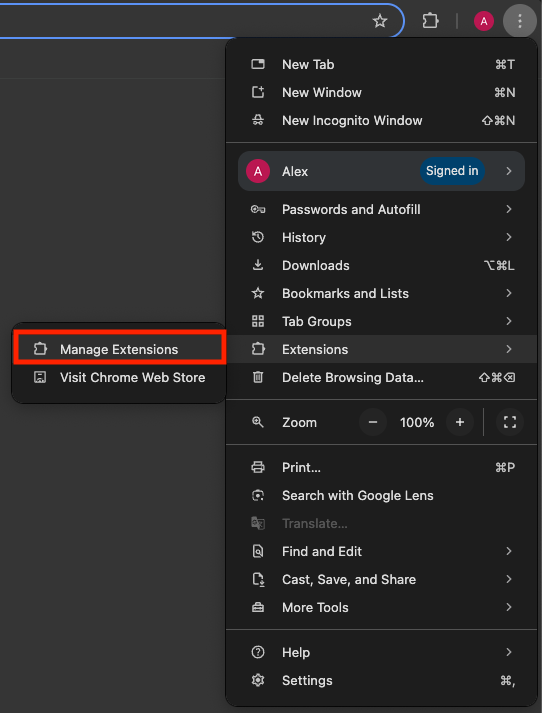
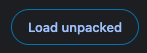

# Block URL Extension

A Chrome extension that blocks URLs of your choice.

Those who want to simply block URLs at a browser level (i.e., personal reason, work distraction, etc) will appreciate this extension to help with their daily browsing.

## Chrome Manifest Version

This extension uses Manifest V3.

## Tech Stack

- React
- TypeScript
- Material UI
- Tailwind CSS
- Monaco Editor

## Development

Follow the steps below to build the extension manually.

1. Install Node.js.
2. Clone the repository.
3. Install dependencies.

```bash
npm install
```

4. Add your code changes.
5. Build the extension.

```bash
npm run build
```

6. The extension contents are located in the `dist` folder.

## Extension Installation

\*\*Before installation and usage, please read the [FAQ](#faq) as it contains important questions and answers which are good to know as a user of this extension.

### Manual

1. Build the extension via the steps in the [development section](#development) or download the pre-compiled `dist` through [GitHub releases](https://github.com/alexwkleung/block-url-extension/releases).

2. Go to "Mange Extensions" on Chrome.



3. Enable "Developer mode".


4. Click on "Load unpacked" and locate the `dist` folder.



## Supported URL Patterns

The following URL patterns have been tested (not 100%):

1. [Steven Black hosts](https://github.com/StevenBlack/hosts) (i.e., `0.0.0.0<whitespace character><url>`)
2. Exact URLs (i.e., `http[s]://<subdomain><url>.<tld>`)
3. Wildcard URLs, including known paths (i.e., `<url>/*`, `<url>/<known path>/*`)
4. URLs without protocol (i.e., `<subdomain>.<url>.<tld>`)
5. URLs without subdomain (i.e., `http[s]://<url>.<tld>`)

## FAQ

1. **Where does my data get stored?**

   - This extension stores the URL data locally on your device.

2. **Why is the `unlimitedStorage` permission enabled?**

   - The `unlimitedStorage` permission is enabled so that there won't be any storage limitations for the extension. Your local device's hard drive is much larger than the allotted 10MB for a Chrome extension and the stored data may exceed that limit if you have a lot of URLs.

3. **Do I need to backup my URLs?**

   - Yes, absolutely. You have to backup your URLs somewhere.
   - For example, if you reinstall the extension, all your URLs will be erased and you have to save them again in the settings.

4. **Are you able to see the URLs in my browser history and visited sites?**

   - No, your browser history and visited sites are only seen by you.
   - The extension will read the data of your tabs (URL, loading state, etc) but your browser history or visited sites are unknown.

5. **How can I confirm that you're not doing anything suspicious when I visit a URL?**

- The service worker and content script are responsible for handling the logic that deals with tabs and when a URL is visited. You can view the respective code here:
  - [service_worker.ts](https://github.com/alexwkleung/block-url-extension/blob/main/src/service-worker/service_worker.ts)
  - [content.ts](https://github.com/alexwkleung/block-url-extension/blob/main/src/content/content.ts)
- Basic overview:
  - `service_worker.ts` runs in the background when the extension is running. It handles displaying the error page and reading your tab data to execute existence logic between the tab URL and storage.
  - `content.ts` handles the document logic on the client, specifically an observer to detect the document state. It communicates with the service worker using messages to execute code.

## Contribute

Feel free to contribute and make this extension better!

## License

MIT License.
