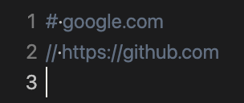

# Ignoring URLs

You can ignore URLs using the comment syntax. Add one of these characters at the beginning of the line to create a comment:

- `#`
- `//`

## Examples

Given the following two lines of comment syntaxes:

```plaintext
# google.com
// https://github.com
```

Would look like this in the editor:


