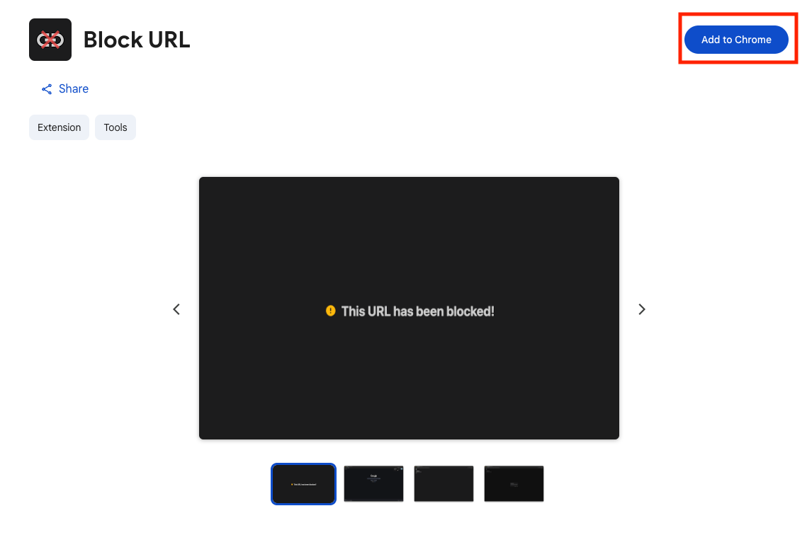
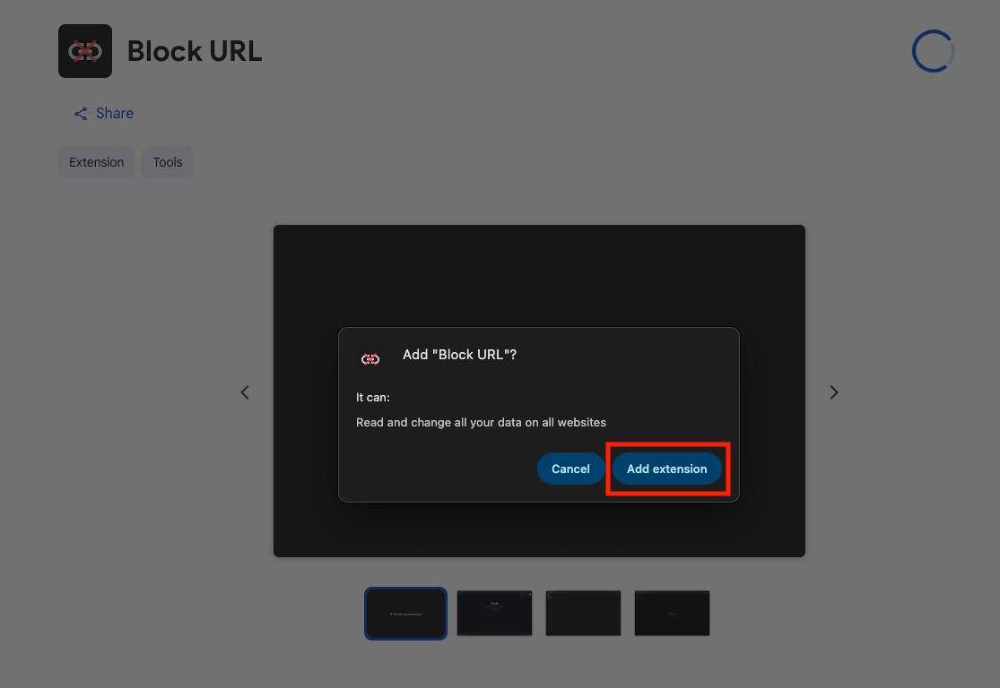

# Installation

For a typical user that wants to install the extension, please follow the [Chrome Web Store](#chrome-web-store) section.

Those who like to tinker with software would want to follow the [Manual](#manual) section.

## Chrome Web Store

::: info
This is the recommended approach for installing the extension.
:::

1. Go to the official [Chrome Web Store](https://chromewebstore.google.com/detail/block-url/kpccminahgnkgkfmodbjeocmeichmoec) page for Block URL. This is the only official Chrome Web Store link.

2. Click "Add to Chrome".

3. Click on "Add extension".

## Manual

::: danger
Any forks or source code that is not from the original repository may introduce a security risk. **You are responsible** for ensuring that your unpacked extensions from source are clean.
:::

1. Build the extension via the steps in [Building the Extension](./building-the-extension) or download the pre-compiled `dist` through one of the [releases](https://github.com/alexwkleung/block-url-extension/releases).

2. Go to "Mange Extensions" on Chrome.

3. Enable "Developer mode".

4. Click on "Load unpacked" and locate the `dist` folder.

