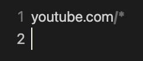
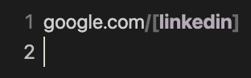
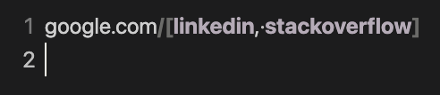

# Supported URL Patterns

Below are the supported URL patterns (not 100% battle tested):

1. [Steven Black hosts](https://github.com/StevenBlack/hosts).
   - `0.0.0.0<whitespace character><url>`
2. Exact URLs
   - `http[s]://<subdomain><url>.<tld>`
3. Wildcard URLs, including known paths.
   - `<url>/*`
   - `<url>/<known path>/*`
4. URLs without protocol.
   - `<subdomain>.<url>.<tld>`
5. URLs without subdomain.
   - `http[s]://<url>.<tld>`
6. Partial keyword URLs.
   - `<url>/[<keyword>, <...>]`

## Examples

### Steven Black Hosts

```plaintext
0.0.0.0 facebook.com
```

### Exact URLs

```plaintext
https://react.dev/reference/react
```

### Wildcard URLs

For example, this would block any URL under youtube.com.

```plaintext
youtube.com/*
```

In the editor, the `/*` part of the URL should be highlighted:



### URLs Without Protocol

```plaintext
www.linkedin.com
```

### URLs without subdomain

```plaintext
https://github.com
```

### Partial Keyword URLs

1. For example, this will block any URL under google.com that contains "linkedin"

```plaintext
google.com/[linkedin]
```

In the editor, the `/[<keyword>]` part of the URL will be highlighted.



2. This example will block any path under google.com that contains either "linkedin" or "stackoverflow" _but not both_.

```plaintext
google.com/[linkedin, stackoverflow]
```

In the editor, the `/[<keyword>, <keyword>]` part of the URL will be highlighted. Each keyword will be highlighted.



## Missing a Pattern?

If there is a pattern that is not supported but you want it, please post a new [issue](https://github.com/alexwkleung/block-url-extension/issues) for it to be considered in a future update. Be descriptive and provide thorough examples.
