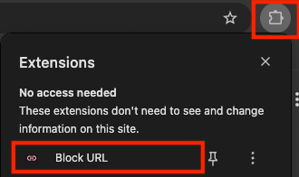
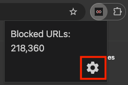
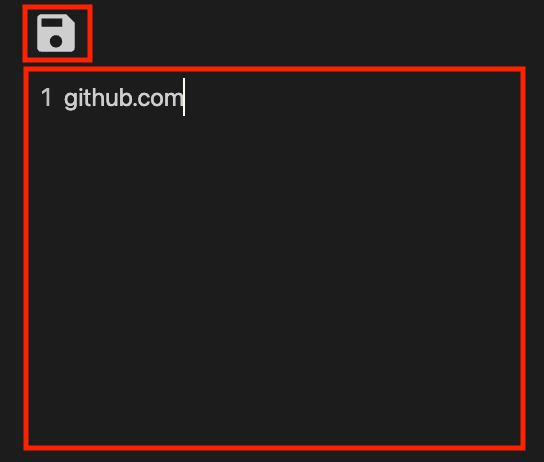
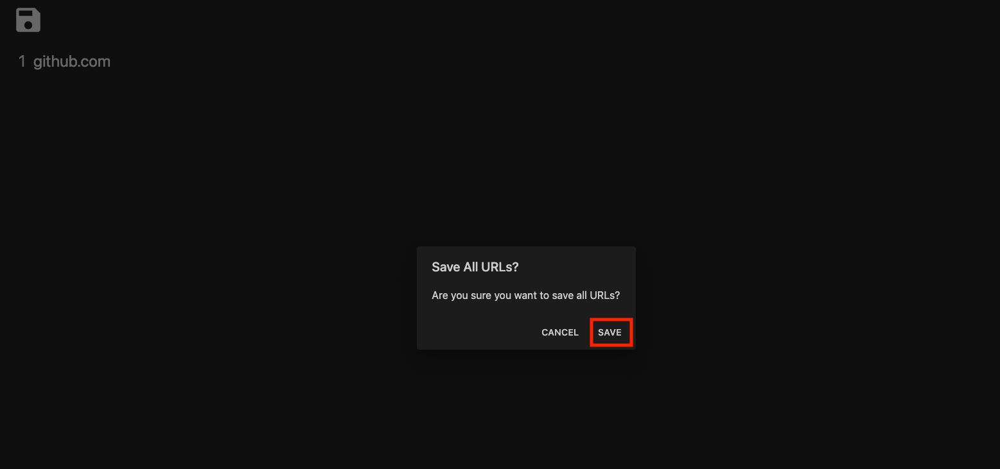
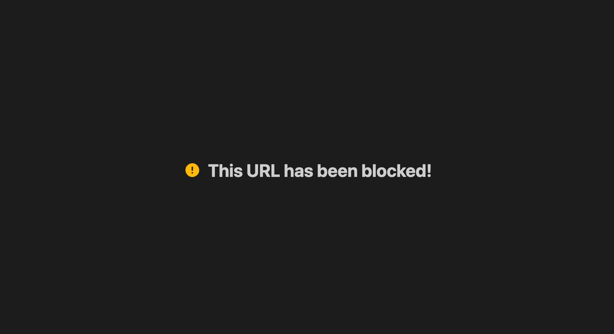
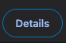
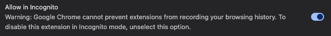

# Using the Extension

The sections below contain the steps to use Block URL.

## Default Usage

1. Open the extension.

2. Open the extension settings.

3. Enter your URLs in the editor. Once you entered them, press the save icon on the top left. Alternatively, you can press Cmd+S (macOS) or Ctrl+S (Windows/Linux) as the save shortcut.

4. A dialog will popup telling you to save. Press the save confirmation button to save the URLs. If you have lots of URLs, this may take a few seconds before it completes the operation.

5. If you go to the URL that you intended to block, it will redirect you to the error page instead of the URL.

## Using the Extension in Incognito

1. Go to "Manage Extensions".

2. Under the Block URL extension, press "Details".

3. Turn on "Allow in Incognito".

